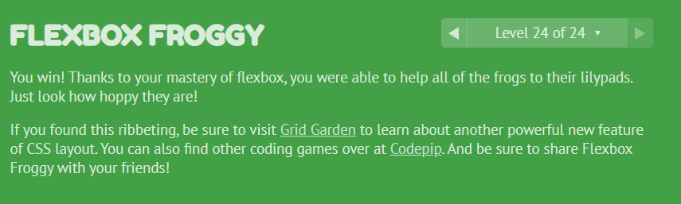
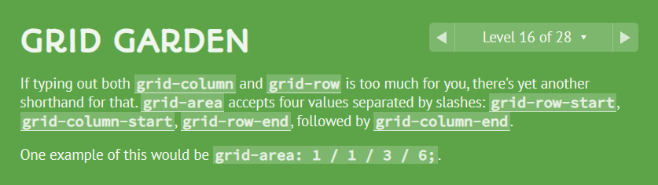

# Flex And Grid Layouts

This project consists of three tasks:

## Task A

Task A is located in [Task_A](Task_A/). It involves creating a grid layout with different sections, each with a unique background color. The CSS for this task can be found in [Task_A/css/style.css](Task_A/css/style.css) and the HTML in [Task_A/index.html](Task_A/index.html).

## Task B

Task B is located in [Task_B](Task_B/). This task involves creating a profile card layout with a circular profile image and user information. The CSS for this task can be found in [Task_B/css/style.css](Task_B/css/style.css) and the HTML in [Task_B/index.html](Task_B/index.html).

## Task C

Task C is located in [Task_C](Task_C/). This task involves creating a grid layout with a header, aside, article with images, and a footer. The CSS for this task can be found in [Task_C/css/style.css](Task_C/css/style.css) and the HTML in [Task_C/index.html](Task_C/index.html).